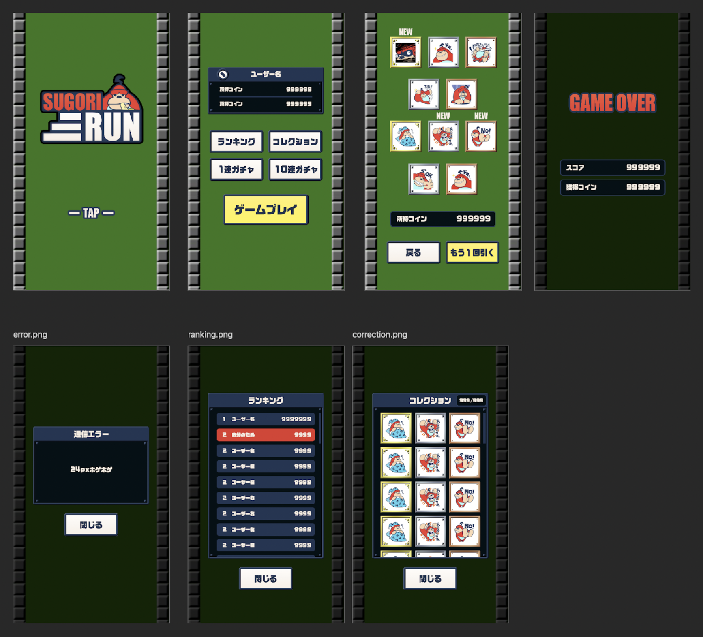

# 概要

CA Tech Dojo Onlineで「スゴリらん！」というゲームのAPI実装を通してGo言語を使用したバックエンド開発をしました。<br>
「スゴリらん！」は8つのAPIを必要とし、そのうち7つのAPIを1週間で実装することができました。</br>

以下が私が実装したAPIです。
1. /user/create
2. /user/get
3. /user/update
4. /collection/list
5. /ranking/list
6. /game/finish
7. /gacha/draw

**考慮した点：**

4. /collection/list
- n+1問題が発生していないか。

5. /ranking/list
- リクエストパラメータに不正な値が設定されている場合を考慮できているか。(start にマイナス値やランキングに登録されているスコア数を超過した値が設定されている場合の考慮)
- 不要なデータの取得を行っていないか。(ユーザーデータの全件取得等)
    
6. /game/finish
- リクエストパラメータに不正な値が設定されている場合を考慮できているか。(score にマイナス値が設定されている場合の考慮)
- 更新処理にTransactionを利用しているか。

7. /gacha/draw
- リクエストパラメータに不正な値が設定されている場合を考慮できているか。(times にマイナス値やAPIサーバやDBに負荷がかかってしまうような大きな値が設定されている場合の考慮)
- n+1問題が発生していないか。
- コレクションアイテムのINSERTクエリが獲得数分発行されていないか。(更新負荷がかかる仕組みになってしまうためINSERTクエリはbulk insertを使用)
- Transactionを利用して原子性が担保されているか。

【ゲーム画面】


【画面遷移図】


## API仕様
API仕様はSwaggerUIを利用して閲覧します。
```
$ docker-compose up swagger-ui
```
を実行することでローカルのDocker上にSwaggerUIサーバが起動します。<br>
<br>
SwaggerUIサーバ起動後以下のURLからSwaggerUIへアクセスすることができます。

SwaggerUI: <http://localhost:3000/> <br> 
定義ファイル: `./api-document.yaml`<br>

# 事前準備
## goimportsとgolangci-lintのinstall
自分の書いたソースコードがプロジェクトのコード規約に則って記述されているか確認したり、整形したりするツールとして**gofmt** 、**goimports**、**golangci-lint**を使用します。<br>
**gofmt**はgoの標準コマンドであるため、goの環境構築を完了させていれば使用できるようになっていると思います。<br>
**goimports**、**golangci-lint**は別途installする必要があるため、以下のコマンドを実行しましょう。
```
$ make local-install
```
コードを整形するときは
```
$ make fmt
```
コード規約に則っているか確認するときは
```
$ make lint
```
を実行して開発を進めました。<br>

## docker-composeを利用したMySQLとRedisの準備
### MySQL
MySQLはリレーショナルデータベースの1つです。
```
$ docker-compose up mysql
```
を実行することでローカルのDocker上にMySQLサーバが起動します。<br>
<br>
初回起動時に db/init ディレクトリ内のDDL, DMLを読み込みデータベースの初期化を行います。<br>

#### PHPMyAdmin
MySQLデータベースのテーブルやレコードの閲覧、変更するためのツールとしてPHPMyAdminを用意しています。
```
$ docker-compose up phpmyadmin
```
を実行することでローカルのDocker上にPHPMyAdminサーバが起動します。<br>
PHPMyAdminサーバ起動後以下のURLからアクセスすることができます。

PHPMyAdmin: <http://localhost:4000/>

#### API用のデータベースの接続情報を設定する
環境変数にデータベースの接続情報を設定します。<br>

```
$ export MYSQL_USER=root \
    MYSQL_PASSWORD=ca-tech-dojo \
    MYSQL_HOST=127.0.0.1 \
    MYSQL_PORT=3306 \
    MYSQL_DATABASE=dojo_api
```

#### Redis
Redisはインメモリデータベースの1つです。<br>
```
$ docker-compose up redis
```
を実行することでローカルのDocker上にMySQLサーバが起動します。

# APIローカル起動方法
```
$ go run ./cmd/main.go
```

## ローカル環境のAPIを使用したゲームプレイ方法
自身が開発しているローカルのAPIを使用して、実際にゲームをプレイする方法は二つあります。場合によって使い分けてください。

**方法１の詳細：Proxyを挟んだゲームプレイ**</br>
今回使用しているクライアント側は、このリポジトリには含まれておらず、インターネット上に公開されています。インターネット上に公開されているアプリケーションが公開されている場所以外にアクセスしようとすると、セキュリティ上の問題があるため一部のブラウザではアクセスをブロックする設定になっています。(CORS)
それを防ぐために、インターネット上にあるものをあたかもローカルに存在するように見せるproxyを用意しました。

### 方法１：docker-compose up proxyでプレイ
Dockerを利用してプレイする方法です。ブラウザに左右されずに動作させることができます。

```
$ docker-compose up -d proxy

// APIローカルも起動させる必要があります。
$ go run ./cmd/main.go
```

ブラウザから下記URLにアクセスしてください。
[http://localhost:3010/app](http://localhost:3010/app)

ID・パスワードはともに `ca-tech-dojo` です。
API接続先には `http://localhost:3010` と入力します。

### 方法２：ローカルを起動し、ブラウザでの直接プレイ

- macOSユーザー推奨: Safari or Firefox
- Windowsユーザー推奨: Firefox

```
// 注：APIローカルは起動させる必要があります
$ go run ./cmd/main.go
```
ブラウザから下記URLにアクセスしてください。
[http://13.114.176.9/](http://13.114.176.9/)

ID・パスワードはともに `ca-tech-dojo` です。
API接続先には `http://localhost:8080` と入力します。(proxy利用の場合と異なるので注意！)
