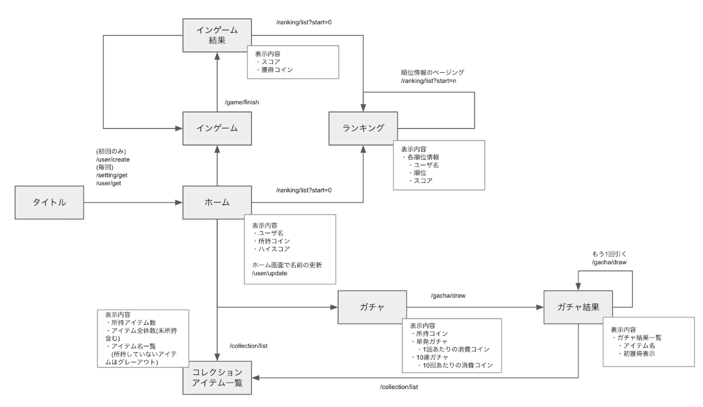

# 概要
<p>
2022年2月21日 - 2022年3月4日<br>
CA Tech Dojo Online で利用するAPIベース実装リポジトリ
</p>

CA Tech Dojo Onlineでは「スゴリらん！」というゲームのAPI実装を通してGo言語を使用したバックエンド開発のノウハウを学んでいきます。<br>
「スゴリらん！」は8つのAPIを必要とし、そのうち7つのAPIを期間中に実装していきます。<br>

課題の具体的な内容は[こちら](./TASKS.md)。

【ゲーム画面】


【画面遷移図】


## API仕様
API仕様はSwaggerUIを利用して閲覧します。
```
$ docker-compose up swagger-ui
```
を実行することでローカルのDocker上にSwaggerUIサーバが起動します。<br>
<br>
SwaggerUIサーバ起動後以下のURLからSwaggerUIへアクセスすることができます。

SwaggerUI: <http://localhost:3000/> <br> 
定義ファイル: `./api-document.yaml`<br>

※ Firefoxはブラウザ仕様により上記サイトからlocalhostへ向けた通信を許可していないので動作しません
- https://bugzilla.mozilla.org/show_bug.cgi?id=1488740
- https://bugzilla.mozilla.org/show_bug.cgi?id=903966

# 事前準備
## docker-composeを利用したMySQLとRedisの準備
### MySQL
MySQLはリレーショナルデータベースの1つです。
```
$ docker-compose up mysql
```
を実行することでローカルのDocker上にMySQLサーバが起動します。<br>
<br>
初回起動時に db/init ディレクトリ内のDDL, DMLを読み込みデータベースの初期化を行います。<br>
(DDL(DataDefinitionLanguage)とはデータベースの構造や構成を定義するためのSQL文)<br>
(DML(DataManipulationLanguage)とはデータの管理・操作を定義するためのSQL文)

#### PHPMyAdmin
MySQLデータベースのテーブルやレコードの閲覧、変更するためのツールとしてPHPMyAdminを用意しています。
```
$ docker-compose up phpmyadmin
```
を実行することでローカルのDocker上にPHPMyAdminサーバが起動します。<br>
PHPMyAdminサーバ起動後以下のURLからアクセスすることができます。

PHPMyAdmin: <http://localhost:4000/>

#### MySQLWorkbenchの設定
※ dockerの環境設定が上手くいかなかった場合に利用推奨<br>
Download: https://www.mysql.com/jp/products/workbench/

MySQLへの接続設定をします。
1. MySQL Connections の + を選択
2. 以下のように接続設定を行う
    ```
    Connection Name: 任意 (dojo_api等)
    Connection Method: Standard (TCP/IP)
    Hostname: 127.0.0.1 (localhost)
    Port: 3306
    Username: root
    Password: ca-tech-dojo
    Default Schema: dojo_api

#### API用のデータベースの接続情報を設定する
環境変数にデータベースの接続情報を設定します。<br>
ターミナルのセッション毎に設定したり、.bash_profileで設定を行います。

Macの場合
```
$ export MYSQL_USER=root \
    MYSQL_PASSWORD=ca-tech-dojo \
    MYSQL_HOST=127.0.0.1 \
    MYSQL_PORT=3306 \
    MYSQL_DATABASE=dojo_api
```

Windowsの場合
```
$ SET MYSQL_USER=root
$ SET MYSQL_PASSWORD=ca-tech-dojo
$ SET MYSQL_HOST=127.0.0.1
$ SET MYSQL_PORT=3306
$ SET MYSQL_DATABASE=dojo_api
```

#### Redis
Redisはインメモリデータベースの1つです。<br>
必須ではありませんが課題の中ででキャッシュやランキングなどの機能でぜひ利用してみましょう。<br>
```
$ docker-compose up redis
```
を実行することでローカルのDocker上にMySQLサーバが起動します。

# APIローカル起動方法
```
$ go run ./cmd/main.go
```

## ビルド方法
作成したAPIを実際にをサーバ上にデプロイする場合は、<br>
ビルドされたバイナリファイルを配置して起動することでデプロイを行います。
### ローカルビルド
Macの場合
```
$ GOOS=linux GOARCH=amd64 go build -o dojo-api ./cmd/main.go
```

Windowsの場合
```
$ SET GOOS=linux
$ SET GOARCH=amd64
$ go build -o dojo-api ./cmd/main.go
```

このコマンドの実行で `dojo-api` という成果物を起動するバイナリファイルが生成されます。<br>
GOOS,GOARCHで「Linux用のビルド」を指定しています。
